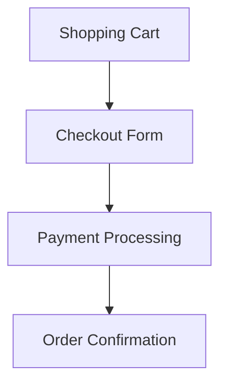
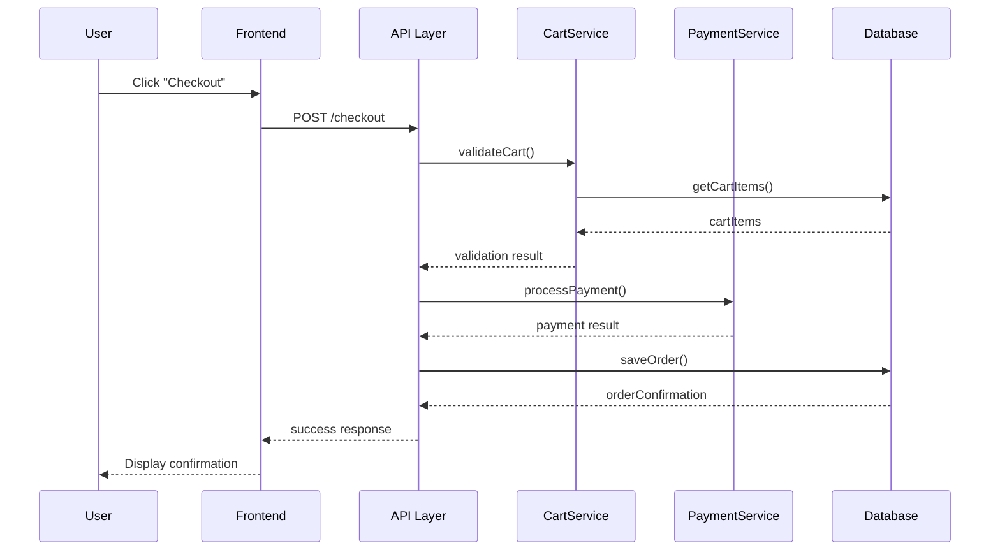

# Chapter 6: Exploring and Modifying Unfamiliar Systems

This directory contains code examples for Chapter 6 of "Fundamentals of Software Engineering," which covers
the skills needed to navigate, understand, and safely modify existing codebases.

## Overview

This chapter demonstrates how to work effectively with unfamiliar systems - a critical skill since most
software development involves existing codebases rather than greenfield projects. The examples progress from
exploring code structure through safe refactoring practices, emphasizing incremental understanding and
risk-minimized modifications.

## Recommended Learning Path

If you're new to working with existing codebases, follow this order:

1. `tracing-requests/` → See how to follow execution flow
2. `refactoring-with-tests/` → Learn test-driven refactoring ⚡
3. `scout-rule-example/` → Practice incremental improvements ⚡

⚡ = Includes "bad vs good" comparisons

## Examples

### 1. `tracing-requests/`
**Concepts:** Finding entry points, following execution flow, request tracing

- Simple Spring Boot web application with RESTful API
- Demonstrates multiple entry points (controllers, endpoints)
- Shows how to trace requests through layers (Controller → Service → Repository)
- Includes logging statements to illustrate request flow
- Tests that document the execution path
- **Run:** `mvn test`

### 2. `refactoring-with-tests/`
**Concepts:** Safe refactoring, test-driven refactoring, preserving behavior

- Shows before/after comparison of refactoring complex methods
- Demonstrates adding tests before refactoring (test-driven refactoring)
- Example of breaking down a complex method into smaller, testable units
- Illustrates how tests serve as a safety net during refactoring
- **Run:** `mvn test`

### 3. `scout-rule-example/`
**Concepts:** Scout rule, incremental improvements, code quality

- Before/after examples showing small, focused improvements
- Demonstrates improving variable names, adding documentation
- Shows removal of dead code and minor refactoring
- Illustrates leaving code "better than you found it"
- **Run:** `mvn test`

## Prerequisites

- Java 21 or higher
- Maven 3.9+ or Gradle 7+
- IDE with JUnit support (IntelliJ IDEA, Eclipse, or VS Code)

## Common Dependencies

All Maven projects in this chapter use these core dependencies:
- JUnit 5 (Jupiter) - Core testing framework
- Spring Boot Test Starter (for Spring examples)
- Mockito - Mocking framework
- AssertJ - Fluent assertion library (optional)

## Key Learning Objectives

After working through these examples, you should understand:

### 1. Understanding Unfamiliar Codebases
- How to start with the big picture: project goals, stakeholders, business context
- The importance of reviewing documentation (ADRs, onboarding docs)
- How to identify architectural patterns from project structure

**Common Architecture Patterns:**

**Package by Layer** - Organizes code horizontally by technical responsibility:
```
src/
├── controllers/
├── services/
├── repositories/
└── models/
```

**Package by Feature** - Organizes code vertically by business capability:
```
src/
├── users/
│   ├── UserController.java
│   ├── UserService.java
│   └── User.java
└── products/
    ├── ProductController.java
    └── ProductService.java
```

### 2. Understanding Execution Flow
- How to find application entry points (main methods, controllers, event handlers)
- Tracing request journeys through browser dev tools, API testing tools, logging, and debugging
- Locating external dependencies through configuration files
- Identifying internal frameworks and custom solutions

### 3. Building Mental Models Incrementally
- Breaking down complex systems into manageable pieces
- Focusing on specific flows rather than entire systems
- Visualizing understanding through diagrams

**Example: Building Mental Models with Diagrams**

Start simple and expand as you learn more. Here's a basic checkout flow in Mermaid syntax:



As you understand more, expand to show interactions:



**Progressive Learning Approach:**
1. Start with single methods in isolation
2. Move to classes and their direct dependencies
3. Continue to feature-level flows spanning multiple components
4. Finally understand cross-cutting concerns (security, transactions)

### 4. Making Changes Safely
- Refactoring safely by relying on existing tests
- Adding tests before refactoring (test-driven refactoring)
- The scout rule: "Always leave the code better than you found it"
- Making small, reversible changes
- Version control best practices

**The Scout Rule in Action:**

Small improvements that make a big difference:
- Adding missing documentation
- Improving variable or method names
- Breaking down overly complex methods
- Removing dead code
- Fixing minor bugs you discover

**When to Refactor:**
- ✅ The code you're working on is difficult to understand
- ✅ You need to add a feature to the area
- ✅ You're fixing a bug in the code
- ✅ Multiple developers frequently work in this area

**When to Defer Refactoring:**
- ⏸️ The code works fine and rarely needs changes
- ⏸️ You're under tight deadline pressure
- ⏸️ You don't have adequate test coverage

**Version Control Best Practices:**
- Make atomic commits (one logical change per commit)
- Write meaningful commit messages (explain what AND why)
- Create feature branches for new work
- Keep branches short-lived (merge within days, not weeks)
- Keep pull requests focused and manageable

## Running All Examples

### Quick Start

Each example is a standalone Maven project. To run any individual example:

```bash
cd <example-directory>
mvn clean test
```

### Run All Tests

To run tests for all examples in sequence:

```bash
# From the CH_06 directory
for dir in tracing-requests refactoring-with-tests scout-rule-example; do
  echo "Testing $dir..."
  (cd $dir && mvn clean test)
done
```

### Requirements

- **Java:** 21 or higher
- **Maven:** 3.9+ (or use included Maven wrapper `./mvnw`)
- **Optional:** IDE with JUnit support for running tests individually

### Troubleshooting

If tests fail to run:
1. Verify Java version: `java -version` (should be 21+)
2. Verify Maven version: `mvn -version` (should be 3.9+)
3. Clean and rebuild: `mvn clean compile`
4. Check for port conflicts (Spring Boot examples use random ports)

### Tips

- **Start with exploration**: Begin with `tracing-requests/` to understand how to navigate code
- **Use your IDE**: Take advantage of debugging features to step through execution
- **Practice the scout rule**: Look for opportunities to make small improvements in `scout-rule-example/`
- **Build incrementally**: Don't try to understand everything at once - focus on one flow at a time
- **Draw diagrams**: Create visual representations of what you're learning (even simple sketches help!)

## A Sample Process for Working with Existing Code

When joining a new project or exploring unfamiliar code, follow this systematic approach:

1. **Clone and review documentation**
   - Clone from source control
   - Review README, architecture docs, coding standards
   - Take notes as you go

2. **Understand the structure**
   - Review build scripts and dependencies
   - Examine project structure (packages, modules, etc.)
   - Review CI/CD pipelines

3. **Set up your environment**
   - Install required dependencies (build tools, runtimes)
   - Run the application from your IDE
   - Run and debug tests

4. **Explore execution paths**
   - Add breakpoints to interesting methods
   - Trace requests through the system
   - Build mental models of key flows

5. **Make small, safe changes**
   - Start with the scout rule (small improvements)
   - Write tests before refactoring
   - Commit frequently with clear messages

Remember: Understanding an existing codebase is an iterative process. You won't comprehend everything on your first pass, and that's completely normal!

## Additional Resources

- **Refactoring: Improving the Design of Existing Code** by Martin Fowler (Addison-Wesley Professional, 2018)
- **Working Effectively with Legacy Code** by Michael Feathers (Prentice Hall, 2004)
- **Getting to Know IntelliJ IDEA** by Trisha Gee and Helen Scott (JetBrains, 2021)
- **Mermaid Diagramming:** https://mermaid.js.org/ - For creating diagrams with code
- **Spring PetClinic:** https://github.com/spring-projects/spring-petclinic - Example application used throughout the chapter
